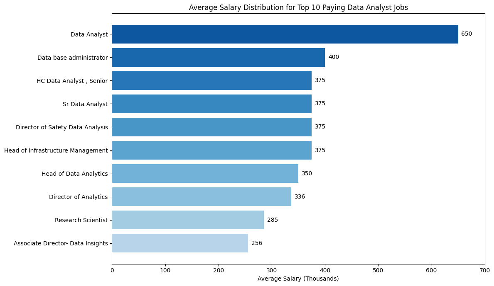
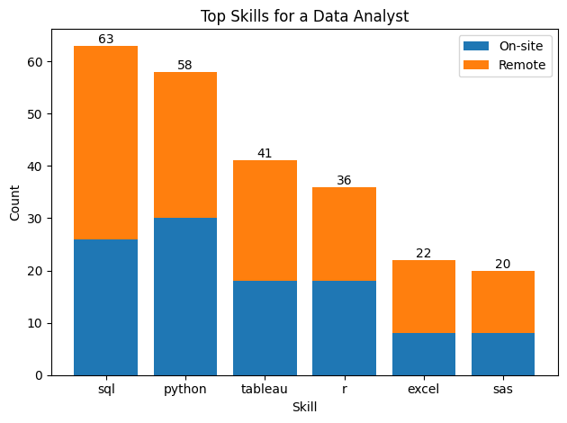

# Introduction
Focusing on data analyst roles, this project explores top-paying jobs, in-demand skills and where high demand meets high salary in data analytics.

SQL queries: [project_sql folder](/project_sql/)

# Background
Driven by a urge to understand the data analyst job market more effectively, this project aims to pinpoint to-paid and in-demand skills, streamlining others work to find optimal jobs.

Dataset from lukebarousse.com/sql

### The questions answered through SQL queries were:

1. What are the top-paying jobs for a Data Analyst?
2. What are the main skills required for a Data Analyst?
3. What are the most in-demand skills for a Data Analyst?
4. What are the top skills based on salary?
5. What are the most optimal skills to learn as a Data Analyst?

# Tools I Used
For this deep dive into the data analyst job market, I leveraged a set of key tools to extract and analyze insights.

- **SQL**: Used to query, filter, and analyze structured data to extract actionable insights.

- **PostgreSQL**: Relational database used to store, manage, and efficiently query large datasets.

- **VS Code**: Code editor used for writing, testing, and managing SQL and analysis scripts.

- **Git & GitHub**: Version control system and platform used to host the repository, document the project, and ensuring collaboration.

# The Analysis
Each query for this project aimed at investigating specific aspects of the data analyst job market.
Here's how I approached each question:

## 1. Top Paying Jobs for Data Analyst
 To identify the highest-paying roles, I filtered data analyst positions by average yearly salary (removing Null Values) and location (comparing on-site and remote jobs). Highlighting the high paying opportunities in the field.

```sql
SELECT
    job_id,
    job_title,
    job_location,
    job_schedule_type,
    salary_year_avg,
    job_posted_date,
    name AS company_name
FROM
    job_postings_fact
LEFT JOIN
    company_dim
    ON
    company_dim.company_id = job_postings_fact.company_id
WHERE
    job_title_short = 'Data Analyst'
    AND
    job_location = 'Anywhere'
    AND
    salary_year_avg IS NOT NULL
ORDER BY
    salary_year_avg DESC
LIMIT 50;
```
### Key observations
- **Wide Salary Range:**
Compensation varies dramatically, from ~$255k to $650k, highlighting how job title, specialization, and seniority heavily influence pay rather than simply being a “Data Analyst.”

- **Strong Presence of Senior & Leadership Roles:**
Many of the highest-paying positions are not traditional analyst roles but include titles like Head of Data Analytics, Director of Analytics, and Research Scientist, indicating that salary growth aligns with strategic and technical responsibility.

- **Specialization Drives Compensation:** Higher-paying roles tend to involve Infrastructure / Data Systems, Advanced Analytics, Strategic Decision-Making and Research & Modeling.


*This is a side bar graph visualizing the salary for the top 10 positions for data analyst; Generated by ChatGPT from my SQL query results*


## 2. Main skills for a Data Analyst
To understand what are the skills for the top-paying jobs, i joined the job postings with the skills data, providing insights into what employers value the most.

```sql
WITH top_paying_jobs AS(
    SELECT
        job_id,
        job_title,
        salary_year_avg,
        name AS company_name
    FROM
        job_postings_fact
    LEFT JOIN
        company_dim
        ON
        company_dim.company_id = job_postings_fact.company_id
    WHERE
        job_title_short = 'Data Analyst'
        AND
        job_location = 'Anywhere'
        AND
        salary_year_avg IS NOT NULL
    ORDER BY
        salary_year_avg DESC
    LIMIT 50
)

SELECT 
    top_paying_jobs.*,
    skills
FROM
    top_paying_jobs
INNER JOIN
    skills_job_dim
    ON
    top_paying_jobs.job_id = skills_job_dim.job_id
INNER JOIN
    skills_dim
    ON
    skills_job_dim.skill_id = skills_dim.skill_id
ORDER BY
    salary_year_avg DESC;
```

### Key observations

- SQL and Phyton are non=negotiable skills for both remote and on-site roles
- Tableau and R are very important skills to have
- Excel and SAS knowledge can be a differential


*Stacked bar chart visualizing the skills required for the top 50 positions as Data Analyst remote and on-site. ChatGPT generate this graph using my SQL query results*

## 3. Top 5 skills for a Data Analyst
This query helped to identify the skills most frequently requested in job postings for Data Analyst.
```sql
SELECT 
    skills,
    COUNT(skills_job_dim.job_id) AS demand_count
FROM
    job_postings_fact
INNER JOIN
    skills_job_dim
    ON
    job_postings_fact.job_id = skills_job_dim.job_id
INNER JOIN
    skills_dim
    ON
    skills_job_dim.skill_id = skills_dim.skill_id
WHERE
    job_title_short = 'Data Analyst'
--    AND job_location = 'Anywhere'
GROUP BY
    skills
ORDER BY
    demand_count DESC
LIMIT 5;
```
### Key observations
- SQL and Excel remain fundamental, emphasizing the need for strong foundational skills in data processing and spreadsheet manipulation
- Python, Tableau and Power BI are essential, pointing towards the increasing importance of technical skills in data storytelling and decision support

| Skills  | Demand Count |
| --------|--------------|
|SQL      | 92628        |
|Excell   | 67031        |
|Python   | 57326        |
|Tableau  | 46554        |
|Power BI | 39468        |

*Table of the demand for the top 5 skills in data analyst job postings*

## 4. Skills based on Salary
Exploring the average salaries associated with different skills revealed which are the highest paying.
```sql
SELECT 
    skills,
    ROUND(AVG(salary_year_avg), 0) AS avg_salary
FROM
    job_postings_fact
INNER JOIN
    skills_job_dim
    ON
    job_postings_fact.job_id = skills_job_dim.job_id
INNER JOIN
    skills_dim
    ON
    skills_job_dim.skill_id = skills_dim.skill_id
WHERE
    job_title_short = 'Data Analyst'
    AND
    salary_year_avg IS NOT NULL
    AND 
    job_work_from_home = True
GROUP BY
    skills
ORDER BY
    avg_salary DESC
LIMIT 50;
```
### Key observations
- **Top-paying “Data Analyst” roles skew toward engineering & ML Skills:** Skills like PySpark, Databricks, Airflow, Kubernetes, and cloud platforms dominate the highest salaries, showing that the best-paid analysts build and scale data systems, not just dashboards.

- **Big data + cloud expertise is the main salary driver:** Distributed computing (Spark, Hadoop), modern warehouses (Snowflake, BigQuery), and cloud platforms (AWS, GCP, Azure) consistently push roles into higher pay bands.

- **Classic analyst tools are table stakes, not differentiators:** Python, R, BI tools, and SQL cap around ~$100k; salary jumps come from automation, MLOps exposure, and production-level tooling (Git, CI/CD, Linux).

| Skills       | Average Salary($) |
| -------------|-------------------|
|pyspark       | 208,172           |
|bitbucket     | 189,155           |
|couchbase     | 160,515           |
|watson        | 160,515           |
|datarobot     | 155,486           |
|gitlab        | 154,500           |
|swift         | 153,750           |
|jupyter       | 152,777           |
|pandas        | 151,821           |
|elasticsearch | 145,000           |

*Table of average salary for the top 10 paying skills for data analyst*

## 5. Most Optimal Skills to Learn
Combining insights from demand and salary data, this query aimed to pinpoint skills that are both in high demand and have high salaries, offering a strategic focus for skill development.

```sql
SELECT
    skills_dim.skill_id,
    skills_dim.skills,
    COUNT(skills_dim.skill_id) AS demand_count,
    ROUND(AVG(job_postings_fact.salary_year_avg),0) AS avg_salary
FROM
    job_postings_fact
INNER JOIN
    skills_job_dim
    ON
    job_postings_fact.job_id = skills_job_dim.job_id
INNER JOIN
    skills_dim
    ON
    skills_job_dim.skill_id = skills_dim.skill_id
WHERE
    job_title_short = 'Data Analyst'
    AND
    salary_year_avg IS NOT NULL
    AND
    job_location = 'Anywhere'
GROUP BY
    skills_dim.skill_id
HAVING
    COUNT(skills_job_dim.job_id) > 10
ORDER BY
    avg_salary DESC,
    demand_count DESC
LIMIT 30;
```
| Skills    | Demand Count | Average Salary ($) |
| ----------|--------------|--------------------|
|go         | 27           | 208,172            |
|confluence | 11           | 189,155            |
|hadoop     | 22           | 160,515            |
|snowflake  | 37           | 160,515            |
|azure      | 34           | 155,486            |
|bigquery   | 13           | 154,500            |
|aws        | 32           | 153,750            |
|java       | 17           | 152,777            |
|ssis       | 12           | 151,821            |
|jira       | 20           | 145,000            |

*Table of the most optimal skills for data analyst sorted by salary*

### Key observations
- **Programming Languages – Python Dominates:**
Python emerges as the most in-demand language due to its versatility across data analysis, automation, machine learning, and data engineering workflows, while R maintains relevance in statistical and research-focused roles.

- **Cloud Tools & Technologies – Core Modern Skills:**
Platforms like Snowflake, AWS, and Azure highlight the industry shift toward cloud-native analytics, where analysts are increasingly expected to understand scalable data environments, performance optimization, and data architecture.

- **Business Intelligence & Visualization – Business Impact Layer:**
Tools such as Tableau and Power BI remain highly demanded, emphasizing that translating data into clear, decision-driving visual insights is critical for stakeholder communication and organizational influence.

- **Database Technologies – SQL as the Foundation:**
SQL stands as the most essential skill, reflecting its role as the universal language for data access, querying, and analytics, making it the fundamental requirement for virtually all data analyst positions.

# What I Learned
Throughout this project, I significantly expanded my SQL toolkit and strengthened my analytical querying skills.

- **Advanced Query Development:** Strengthened proficiency in complex SQL operations, including multi-table joins and the use of Common Table Expressions (CTEs) to structure and optimize queries.

- **Data Aggregation & Summarization:** Applied GROUP BY and aggregate functions such as COUNT() and AVG() to generate meaningful summaries and analytical insights.

- **Analytical Problem-Solving:** Enhanced the ability to translate business questions into structured SQL queries, enabling data-driven decision-making.

# Conclusions

### Insights
From the analysis, several general insights emerged:

1. **Significant Salary Dispersion Across Data Analyst Roles:**
Top-paying data analyst positions show a wide compensation range (up to $650k), indicating that salary outcomes are heavily influenced by seniority, specialization, and scope of responsibility rather than job title alone.

2. **SQL as the Primary Career Foundation:**
SQL consistently appears as both the most demanded skill and a core requirement in top-paying roles, reinforcing its position as the fundamental competency for data professionals.

3. **Demand Concentration Around Core Analytical Tools:**
The job market strongly prioritizes foundational skills such as SQL, Python, Excel, and leading BI platforms (Tableau, Power BI), highlighting the enduring importance of data querying, analysis, and visualization capabilities.

4. **Specialized & Engineering-Oriented Skills Drive Salary Premiums:**
Higher salary brackets are associated with big data, cloud, and engineering-adjacent technologies (PySpark, Hadoop, Snowflake, Cloud Platforms), suggesting that technical depth and infrastructure knowledge create strong compensation leverage.

5. **Optimal Skill Strategy Balances Demand & Compensation:**
Skills like SQL, Python, Snowflake, and Cloud Technologies represent the strongest combination of market demand and salary potential, making them strategic priorities for long-term career growth.

### Closing Thoughts
This project strengthened my SQL expertise while delivering data-driven insights into the data analyst job market. The analysis highlights how skill demand, compensation, and specialization intersect, providing a structured perspective for prioritizing professional development. The findings emphasize the strategic value of focusing on high-demand, high-impact skills and reinforce the importance of continuous learning in an evolving analytics landscape.